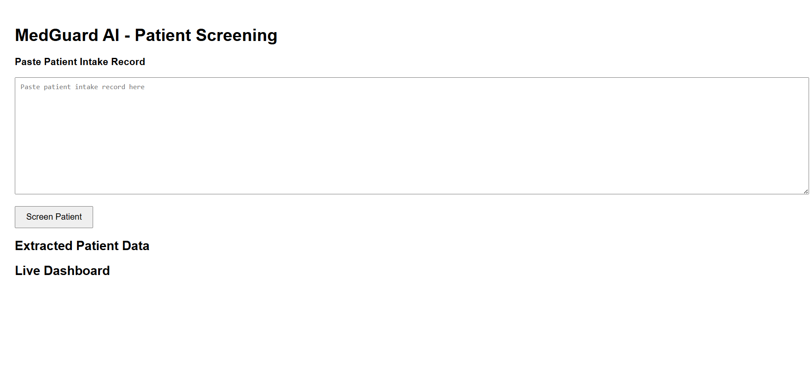
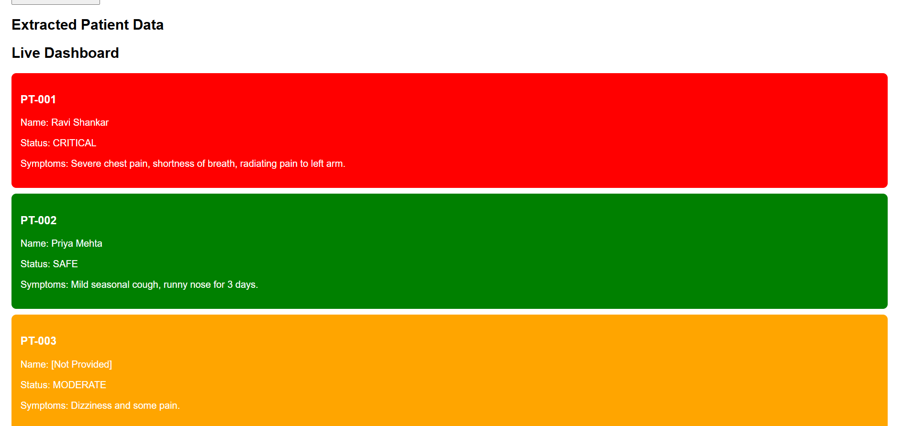
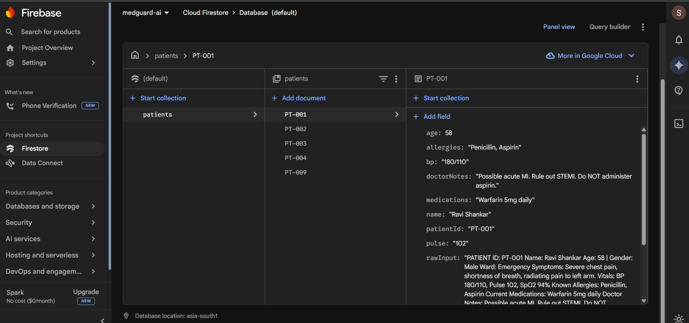

# 🚑 MedGuard AI — Intelligent Patient Screening System

  <b>AI-powered system to analyze patient intake data and detect risk levels in real-time</b>

  
  
  
  

---

## 📌 Overview

MedGuard AI is a **web-based intelligent screening system** that processes unstructured patient intake records and classifies them into:

- 🔴 **CRITICAL**
- 🟠 **MODERATE**
- 🟢 **SAFE**

The system helps simulate how AI can assist in **early risk detection in healthcare systems**.

---

## ⚡ Key Features

✔ Extracts structured data from raw patient input  
✔ Applies rule-based triage classification  
✔ Stores records in **Firebase Firestore**  
✔ Real-time **live dashboard updates**  
✔ Color-coded patient status system  

---

## 🛠️ Tech Stack

| Technology | Usage |
|----------|------|
| HTML, CSS, JS | Frontend UI |
| Firebase Firestore | Database |
| Firebase Hosting | Deployment |
| JavaScript Logic | Risk classification |

---

## 🚀 Live Demo

👉 https://medguard-ai-ce760.web.app  

---

## 🧠 How It Works

1. Paste patient intake record  
2. System extracts key medical details  
3. Applies triage logic  
4. Stores data in Firestore  
5. Displays results on live dashboard  

---

## ⚠️ Triage Logic
CRITICAL:

Chest pain / shortness of breath
SpO2 < 96
BP > 160
Allergy risk

MODERATE:

Missing name / age / vitals

SAFE:

Normal conditions

CRITICAL:

Chest pain / shortness of breath
SpO2 < 96
BP > 160
Allergy risk

MODERATE:

Missing name / age / vitals

SAFE:

Normal conditions

---

## 📷 Screenshots

### 📝 Input & Processing UI

---

### 📊 Live Dashboard

---

### ☁️ Firestore Database

---

## 👥 Team

- **B. Shanmuk Reddy**
- **P. Maneesh Sharma**
- **K. Pavan Sharma**

---

## 📚 Learnings

- Built a complete real-time web application  
- Worked with Firebase Firestore & hosting  
- Learned how to handle unstructured data  
- Applied logic to simulate real-world AI use cases  
- Improved teamwork and problem-solving  

---

## 🔮 Future Improvements

- Integrate real AI models (Gemini / GPT)  
- Add alert system for critical patients  
- Improve UI/UX design  
- Add analytics dashboard  

---

## 🙌 Final Note

This project was developed as part of a learning experience and demonstrates how **AI concepts can be applied to solve real-world problems in healthcare**.

---

  ⭐ If you found this project useful, consider giving it a star!

